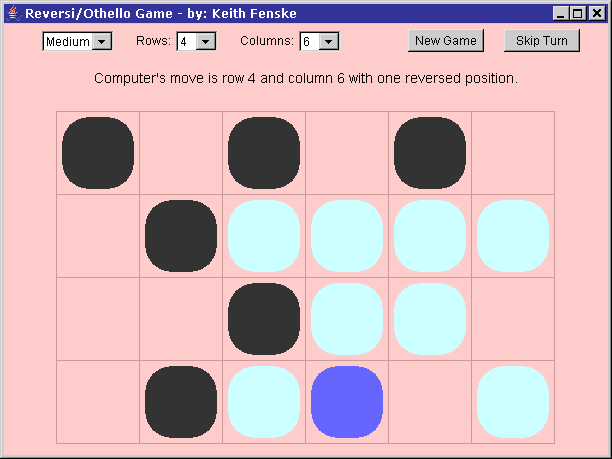

### Reversi Game (Java)

by: Keith Fenske, https://kwfenske.github.io/

Reversi is an old Java 1.1 AWT (GUI) applet to play the board game of Reversi,
also known as Othello. The playing board is a rectangular grid. Your positions
are shown as black circles. Positions occupied by the computer are shown in
white. You move first. A legal move is any empty position that traps one or
more of the computer's positions in a straight line (horizontal, vertical, or
diagonal) between the empty position and another of your positions. The trapped
positions are then "flipped" (reversed) and become your positions. To help you,
legal moves are highlighted when you hold the mouse over an empty position. If
you can't move, then you lose your turn and the computer moves next. The game
ends when nobody can move. The player with the most occupied positions is the
winner.

The program's comments and documentation reference web sites that no longer
exist, and discuss differences in Java versions that are now meaningless. No
changes will be considered. Web page applets are obsolete and may run as
stand-alone applications with the help of a wrapper (included). This becomes
less likely after Java 9 (2017). Rewriting for Java Swing or newer JavaFX is
not an easy job.

Download the ZIP file here: https://kwfenske.github.io/reversi-game-java.zip

Released under the terms and conditions of the GNU General Public License,
version 3 or later (GPLv3+).

